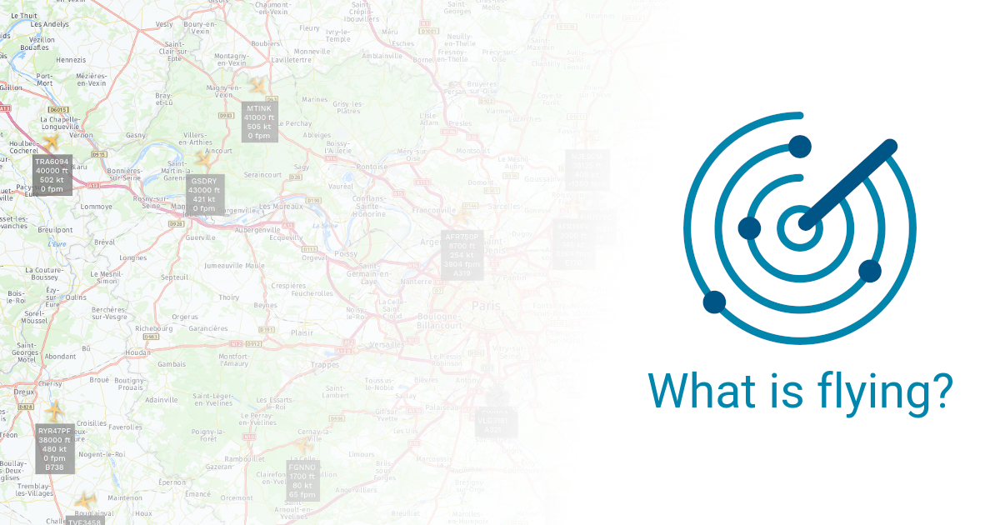

# What is flying? Database

  

This repository contains the database for [https://whatisflying.com](https://whatisflying.com), a real time aircraft tracker & aeronautical database.

## Statistics

- 41,300 aircraft, 6,700 with a picture. 
- 590 aircraft types, 490 with a picture.
- 190 aircraft models.
- 2,000 airlines, 800 with a picture, 300 with a logo.
- 10,000 airports.
- 8,600 airport runways.
- 18,700 airport radio frequencies.
- 50,900 airport statistic datasets.
- 367,900 flights.
- 270 flight information regions.
- 20,500 navaids.
- 211,600 fixes / waypoints.

## Database structure

The database consists of the following datasets:

### Aircraft

This dataset includes the following files:

#### aircraft.csv

This file contains informations on aircraft. Only aircraft of manufacturers for which there are very few aircraft are placed in this file. See the table below for the structure of this file.

#### aircraft/*manufacturer*.csv

These files contains informations on aircraft, for a single manufacturer. The structure of these files is as follows:

| Column             |     Type     | Description                                                  |       Example       |
| ------------------ | :----------: | ------------------------------------------------------------ | :-----------------: |
| icao_24bit_address |    string    | The ICAO 24-bit address of the aircraft.                     |       38fcbb        |
| registration       |    string    | The registration of the aircraft.                            |       F-GXLG        |
| manufacturer       |    string    | The manufacturer of the aircraft.                            |       Airbus        |
| model              |    string    | The model of the aircraft.                                   | A330-743L Beluga XL |
| aircraft_type      |    string    | The type of the aircraft, as an ICAO code.                   |        A337         |
| serial_number      |    string    | The manufacturer serial number of the aircraft.              |        1824         |
| description        |    string    | The description of the aircraft, as defined in the ICAO Document 8643. |         L2J         |
| operator           | string\|null | The airline which operates the aircraft, as an ICAO code.    |         AIB         |
| registered_at      |  date\|null  | The date the aircraft was registered.                        |     2020-01-01      |
| registered_until   |  date\|null  | The date the aircraft registration expires.                  |     2022-12-31      |
| manufactured_at    |  date\|null  | The date the aircraft was manufactured.                      |     2019-12-31      |

#### aircraft_pictures.csv

This file contains the list of photographs of aircraft as well as information on the author and the license issued by the latter. The structure of this file is as follows:

| Column         |     Type     | Description                                                  |                      Example                      |
| -------------- | :----------: | ------------------------------------------------------------ | :-----------------------------------------------: |
| aircraft       |    string    | The ICAO 24-bit address of the aircraft.                     |                      38fcbb                       |
| picture        |    string    | The relative path to the file.                               |           aircraft_pictures/38fcbb.webp           |
| source         |    string    | The source of the picture.                                   | https://www.flickr.com/photos/johndoe/1234567890/ |
| author_name    |    string    | The name of the picture author.                              |                     John Doe                      |
| author_profile | string\|null | The URL of the picture author's profile.                     |      https://www.flickr.com/photos/johndoe/       |
| license        |    string    | The license of the picture, as an SPDX license identifier ¹. |                   CC-BY-SA-2.0                    |

¹  See https://spdx.org/licenses/ for a list of valid identifiers.

------

### Aircraft types

This dataset includes the following files:

#### aircraft_types.csv

This file contains information on aircraft types. The structure of this file is as follows:

| Column              |     Type      | Description                                                  |  Example  |
| ------------------- | :-----------: | ------------------------------------------------------------ | :-------: |
| icao_code           |    string     | The ICAO code of the aircraft type.                          |   A35K    |
| iata_code           | string\|null  | The IATA code of the aircraft type.                          |    351    |
| manufacturer        |    string     | The manufacturer of the aircraft.                            |  Airbus   |
| name                |    string     | The name of the aircraft type.                               | A350-1000 |
| description         |    string     | The description of the aircraft, as defined in the ICAO Document 8643. |    L2J    |
| wtc                 |    string     | The wake turbulence category of the aircraft, as defined in the ICAO Document 8643. |     H     |
| length              |  float\|null  | The length of the aircraft, in metres.                       |   73.78   |
| height              |  float\|null  | The height of the aircraft, in metres.                       |   16.90   |
| wingspan            |  float\|null  | The wingspan of the aircraft, in metres.                     |   64.75   |
| wing_area           |  float\|null  | The wing area of the aircraft, in square metres.             |  464.30   |
| fuselage_height     |  float\|null  | The height of the aircraft fuselage, in metres.              |   5.96    |
| fuselage_width      |  float\|null  | The width of the aircraft fuselage, in metres.               |   5.96    |
| main_rotor_diameter |  float\|null  | The diameter of the aircraft main rotor, in metres.          |           |
| main_rotor_area     |  float\|null  | The area of the aircraft main rotor, in square metres.       |           |
| mzfw                | integer\|null | The maximum zero-fuel weight of the aircraft, in kilograms.  |  220000   |
| mrw                 | integer\|null | The maximum ramp weight of the aircraft, in kilograms.       |  317500   |
| mtow                | integer\|null | The maximum takeoff weight of the aircraft, in kilograms.    |  316000   |
| mlw                 | integer\|null | The maximum landing weight of the aircraft, in kilograms.    |  236000   |
| fuel_capacity       | integer\|null | The fuel capacity of the aircraft, in litres.                |  158791   |
| approach_speed      | integer\|null | The approach speed (VRef) of the aircraft, in knots. |    142    |
| cruise_speed        | integer\|null | The cruise speed (Vno) of the aircraft, in knots. |    500    |
| maximum_speed       | integer\|null | The maximum speed (Vne) of the aircraft, in knots. |    520    |
| service_ceiling     | integer\|null | The service ceiling of the aircraft, in feet.                |   35000   |
| absolute_ceiling    | integer\|null | The absolute ceiling of the aircraft, in feet.               |   41450   |
| operating_range     | integer\|null | The operating range of the aircraft, in nautical miles.      |   16100   |
| type_certificate    | string\|null  | The URL of the aircraft type certificate.                    |           |

#### aircraft_types_pictures.csv

This file contains the list of photographs of aircraft types as well as information on the author and the license issued by the latter. The structure of this file is as follows:

| Column        |  Type  | Description                                                  |             Example             |
| ------------- | :----: | ------------------------------------------------------------ | :-----------------------------: |
| aircraft_type  |    string    | The ICAO code of the aircraft type. | A359 |
| picture        |    string    | The relative path to the file. | aircraft_types_pictures/A359.webp |
| source         |    string    | The source of the picture. | https://www.flickr.com/photos/johndoe/1234567890/ |
| author_name    |    string    | The name of the picture author. | John Doe |
| author_profile | string\|null | The URL of the picture author's profile. | https://www.flickr.com/photos/johndoe/ |
| license        |    string    | The license of the picture, as an SPDX license identifier ¹. | CC-BY-SA-2.0 |

¹  See https://spdx.org/licenses/ for a list of valid identifiers.

#### aircraft_models.csv

This file contains information on aircraft models. The structure of this file is as follows:

| Column              |    Type    | Description                                                  |          Example          |
| ------------------- | :--------: | ------------------------------------------------------------ | :-----------------------: |
| aircraft_type       |   string   | The ICAO code of the aircraft type.                          |           A359            |
| name                |   string   | The name of the aircraft model.                              |         A350-941          |
| engine_manufacturer |   string   | The manufacturer of the aircraft engines.                    |        Rolls Royce        |
| engine_model        |  string[]  | The model of the aircraft engines. Multiple semicolon separated values are allowed. | Trent XWB-75;Trent XWB-84 |
| certified_at        | date\|null | The the date the aircraft model was certified.               |        2014-09-30         |

------

### Airlines

This dataset includes the following files:

#### airlines.csv

This file contains information on airlines. The structure of this file is as follows:

| Column                       |     Type      | Description                                                  |  Example   |
| ---------------------------- | :-----------: | ------------------------------------------------------------ | :--------: |
| icao_code                    |    string     | The ICAO code of the airline.                                |    AFR     |
| iata_code                    | string\|null  | The IATA code of the airline.                                |     AF     |
| name                         |    string     | The name of the airline.                                     | Air France |
| country                      |    string     | The country where the airline operates, as an ISO 3166-1 alpha-2 code. |     FR     |
| callsign                     | string\|null  | The callsign of the airline.                                 |  AIRFRANS  |
| active                       |    boolean    | Whether the airline is active.                               |     1      |
| international                |    boolean    | Whether the airline operates international flights.          |     1      |
| iata_member                  |    boolean    | Whether the airline is member of the IATA.                   |     1      |
| iosa_certified               |    boolean    | Whether the airline is IOSA certified.                       |     1      |
| average_fleet_age            |  float\|null  | The average age of the airline fleet.                        |   10.84    |
| aircraft_over_25_years       | integer\|null | The number of aircraft over 25 years old within the airline fleet. |     0      |
| accidents_last_5_years       | integer\|null | The number of accidents involving the airline during the last 5 years. |     7      |
| fatal_accidents_last_5_years | integer\|null | The number of fatal accidents involving the airline during the last 5 years. |     0      |
| destinations                 | integer\|null | The number of destinations serviced by the airline.          |    178     |
| annual_domestic_flights      | integer\|null | The number of domestic flights operated annually by the airline. |   96789    |
| annual_international_flights | integer\|null | The number of international flights operated annually by the airline. |   171510   |

#### airlines_logos.csv

This file contains the list of airlines logos. The structure of this file is as follows:

| Column  |  Type  | Description                    |        Example         |
| ------- | :----: | ------------------------------ | :--------------------: |
| airline | string | The ICAO code of the airline.  |          AFR           |
| logo    | string | The relative path to the file. | airlines_logos/AFR.svg |

#### airlines_pictures.csv

This file contains the list of photographs of aircraft wearing the livery of airlines as well as information on the author and the license issued by the latter. The structure of this file is as follows:

| Column  |  Type  | Description                                                  |         Example          |
| ------- | :----: | ------------------------------------------------------------ | :----------------------: |
| airline        |    string    | The ICAO code of the airline. | AFR |
| picture        |    string    | The relative path to the file. | airlines_pictures/AFR.webp |
| source         |    string    | The source of the picture. | https://www.flickr.com/photos/johndoe/1234567890/ |
| author_name    |    string    | The name of the picture author. | John Doe |
| author_profile | string\|null | The URL of the picture author's profile. | https://www.flickr.com/photos/johndoe/ |
| license        |    string    | The license of the picture, as an SPDX license identifier ¹. | CC-BY-SA-2.0 |

¹  See https://spdx.org/licenses/ for a list of valid identifiers.

------

### Airports

This dataset includes the following files:

#### airports.csv

This file contains information on airports. The structure of this file is as follows:

| Column        |     Type      | Description                                                  |         Example          |
| ------------- | :-----------: | ------------------------------------------------------------ | :----------------------: |
| icao_code     |    string     | The ICAO code of the airport.                                |           LFBO           |
| iata_code     | string\|null  | The IATA code of the airport.                                |           TLS            |
| name          |    string     | The name of the airport.                                     | Toulouse-Blagnac Airport |
| type          |    string     | The type of the airport ¹.                                   |          large           |
| latitude      |  float\|null  | The latitude of the airport, in degrees.                     |          43.635          |
| longitude     |  float\|null  | The longitude of the airport, in degrees.                    |         1.36778          |
| elevation     | integer\|null | The elevation of the airport, in feet AMSL.                  |           482            |
| fir           |    string     | The flight information region to which the airport belongs.  |           LFBB           |
| continent     |    string     | The continent where the airport is located, as a 2 letter continent code. |            EU            |
| country       |    string     | The country where the airport is located, as an ISO 3166-1 alpha-2 code. |            FR            |
| active        |    boolean    | Whether the airport is active.                               |            1             |
| international |    boolean    | Whether the airport is international.                        |            1             |

¹ Can take one of the following values: *small* (airstrip), *medium* (air base or local airport) and *large* (international airport).

#### airports_datasets.csv

This file contains statistics about airports. The structure of this file is as follows:

| Column                     |  Type   | Description                                                  | Example |
| -------------------------- | :-----: | ------------------------------------------------------------ | :-----: |
| airport                    | string  | The ICAO code of the airport.                                |  LFBO   |
| year                       | integer | The year for which the dataset apply.                        |  2019   |
| domestic_departures        | integer | The number of domestic flights that departed from the airport. |  20206  |
| international_departures   | integer | The number of international flights that departed from the airport. |  18380  |
| domestic_destinations      | integer | The number of domestic destinations serviced by the airport. |   48    |
| international_destinations | integer | The number of international destinations serviced by the airport. |   99    |

#### airports_frequencies.csv

This file contains information on radio frequencies used at airports. The structure of this file is as follows:

| Column      |  Type   | Description                                                | Example |
| ----------- | :-----: | ---------------------------------------------------------- | :-----: |
| airport     | string  | The ICAO code of the airport.                              |  LFBO   |
| description | string  | The description of the radio frequency.                    |   TWR   |
| frequency   | integer | The actual frequency of the radio frequency, in kilohertz. | 118100  |
| type        | string  | The type of the radio frequency ¹.                         |   TWR   |

¹ Commonly used values: *AFIS*, *ATIS*, *APP* (approach), *DEP* (departure), *GND* (ground), *TWR* (tower),  *PFLT* (preflight),...

#### airports_runways.csv

This file contains informations on airport runways. The structure of this file is as follows:

| Column                 |     Type      | Description                                                  | Example |
| ---------------------- | :-----------: | ------------------------------------------------------------ | :-----: |
| airport                |    string     | The ICAO code of the airport.                                |  LFBO   |
| length                 |    integer    | The length of the runway, in feet.                           |  9843   |
| width                  |    integer    | The width of the runway, in feet.                            |   148   |
| le_name                |    string     | The name of the runway lower end.                            |   14L   |
| le_latitude            |     float     | The latitude of the runway lower end, in degrees.            | 43.6374 |
| le_longitude           |     float     | The longitude of the runway lower end, in degrees.           | 1.35762 |
| le_elevation           | integer\|null | The elevation of the runway lower end, in feet AMSL.         |   490   |
| le_heading             |  float\|null  | The magnetic heading of the runway lower end, in degrees.    |   143   |
| le_displaced_threshold | integer\|null | The length of the runway higher end displaced threshold, in feet. |         |
| he_name                |    string     | The name of the runway higher end.                           |   32R   |
| he_latitude            |     float     | The latitude of the runway higher end, in degrees.           | 43.6156 |
| he_longitude           |     float     | The longitude of the runway higher end, in degrees.          | 1.38022 |
| he_elevation           | integer\|null | The elevation of the runway higher end, in feet AMSL.        |   497   |
| he_heading             |  float\|null  | The magnetic heading of the runway higher end, in degrees.   |   323   |
| he_displaced_threshold | integer\|null | The length of the runway higher end displaced threshold, in feet. |         |
| surface                | string\|null  | The runway surface type code ¹.                              |   CON   |
| lighted                |    boolean    | Whether the runway is lighted.                               |    1    |
| active                 |    boolean    | Whether the runway is active.                                |    1    |

¹ Can take one of the following values: *ASP* (Asphalt), *BIT* (Bituminous asphalt), *BRI* (Bricks), *CLA* (Clay), *COM* (Composite), *CON* (Concrete), *COP* (Composite), *COR* (Coral), *GRE* (Grass or earth, graded/rolled), *GRS* (Grass or earth, non graded/rolled), *GVL* (Gravel), *ICE* (Ice), *LAT* (Laterite), *MAC* (Macadam), *PEM* (Partially asphalt, bituminous asphalt or concrete), *PER* (Permanent surface, details unknown), *PSP* (Pierced-steel planking), *SAN* (Sand), *SMT* (Sommerfeld tracking), *SNO* (Snow) or *UNK* (Unknown).

------

### Fixes

This dataset includes the following files:

#### fixes.csv

This file contains informations on fixes / waypoints. The structure of this file is as follows:

| Column     |     Type     | Description                                                  |    Example    |
| ---------- | :----------: | ------------------------------------------------------------ | :-----------: |
| slug       |    string    | The slug used to identify the fix ¹.                         | 18vor-lf-lfbo |
| identifier |    string    | The identifier of the fix.                                   |     18VOR     |
| latitude   |    float     | The latitude of the fix, in degrees.                         | 43.705230556  |
| longitude  |    float     | The longitude of the fix, in degrees.                        |  1.285716667  |
| usage      |    string    | The usage of the fix ².                                      |   TERMINAL    |
| region     |    string    | The ICAO region of the fix, as defined in the ICAO Document 7910. |      LF       |
| airport    | string\|null | The airport to which the fix is associated, as an ICAO code. |     LFBO      |

¹ A globally unique combination of the identifier, region and airport.

² Can take one of the following values: *ENROUTE* (En-route navigation) or *TERMINAL* (Approach). 

------

### Flights

This dataset includes the following files:

#### flights.csv

This file contains informations on flights. The structure of this file is as follows:

| Column            |      Type      | Description                                                  | Example |
| ----------------- | :------------: | ------------------------------------------------------------ | :-----: |
| airline           |     string     | The airline for which the flight is operated, as an ICAO code. |   AFR   |
| flight_number     |     string     | The flight number.                                           | AFR1032 |
| departure_airport |     string     | The departure airport of the flight, as an ICAO code.        |  LFPG   |
| arrival_airport   |     string     | The arrival airport of the flight, as an ICAO code.          |  LGAV   |
| layover_airports  | string[]\|null | The layover airports of the flight, as a semicolon separated list of ICAO codes. |         |

------

### Flight information regions

This dataset includes the following files:

#### firs.csv

This file contains informations on flight information regions. The structure of this file is as follows:

| Column    |  Type  | Description                                     | Example  |
| --------- | :----: | ----------------------------------------------- | :------: |
| icao_code | string | The ICAO code of the flight information region. |   LFBB   |
| name      | string | The name of the flight information region.      | BORDEAUX |

------

### Navaids

This dataset includes the following files:

#### navaids.csv

This file contains informations on navigational aids. The structure of this file is as follows:

| Column               |     Type      | Description                                                  |         Example          |
| -------------------- | :-----------: | ------------------------------------------------------------ | :----------------------: |
| slug                 |    string     | The slug used to identify the navaid ¹.                      |      tou-vor-dme-lf      |
| identifier           |    string     | The identifier of the navaid.                                |           TOU            |
| name                 |    string     | The name of the navaid.                                      | TOULOUSE BLAGNAC VOR/DME |
| type                 |    string     | The type of the navaid ².                                    |         VOR-DME          |
| usage                |    string     | The usage of the navaid ³.                                   |         ENROUTE          |
| frequency            |    integer    | The frequency of the navaid, in kilohertz.                   |          117700          |
| dme_channel          | string\|null  | The channel of the navaid DME part.                          |           124X           |
| dme_rx_frequency     | integer\|null | The RX frequency of the navaid DME part, in kilohertz.       |         1148000          |
| dme_tx_frequency     | integer\|null | The TX frequency of the navaid DME part, in kilohertz.       |         1211000          |
| dme_bias             |  float\|null  | The bias of the navaid DME part, in nautical miles.          |            0             |
| vor_slaved_variation |  float\|null  | The slaved variation of the navaid VOR part, in degrees.     |            0             |
| localizer_heading    |  float\|null  | The magnetic heading of the navaid localizer part, in degrees. |                          |
| glide_slope_angle    |  float\|null  | The angle of the navaid glide slope part, in degrees.        |                          |
| reception_range      |    integer    | The reception range of the navaid, in nautical miles.        |           130            |
| latitude             |     float     | The latitude of the navaid, in degrees.                      |       43.680833333       |
| longitude            |     float     | The longitude of the navaid, in degrees.                     |       1.309805556        |
| elevation            | integer\|null | The elevation of the navaid, in feet AMSL.                   |           574            |
| region               |    string     | The ICAO region of the navaid, as defined in the ICAO Document 7910. |            LF            |
| airport              | string\|null  | The airport to which the navaid is associated, as an ICAO code. |                          |
| airport_runway       | string\|null  | The airport runway to which the navaid is associated.        |                          |
| country              |    string     | The country where the navaid is located, as an ISO 3166-1 alpha-2 code. |            FR            |

¹ A globally unique combination of the identifier, type, region and airport.

² Can take one of the following values: *DME*, *DME-ILS*, *GS*, *IGS*, *ILS-I*, *ILS-II*, *ILS-III*, *LDA*, *LOC*, *NDB*, *SDF*, *TACAN*, *VOR*, *VOR-DME* or *VORTAC*.

³ Can take one of the following values: *ENROUTE* (En-route navigation) or *TERMINAL* (Approach).

## License

Data is published under the terms of the [ODC Open Database License v1.0](https://spdx.org/licenses/ODbL-1.0.html).

## Contributing

Feel free to contribute, but please read the [contribution guidelines](docs/contributing.md) before.
